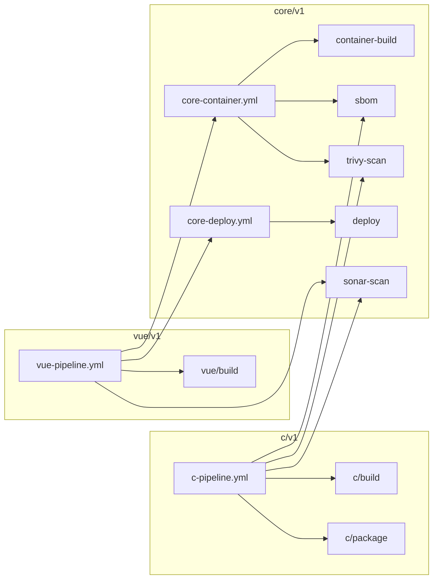

# pipeline-actions

Shared GitHub Actions for building, scanning and shipping containers, Vue apps
and C projects. One repo, versioned by **domain**.

<div class="grid cards" markdown>

-   :material-rocket-launch: **Getting started**

    ---

    Set up the library in your org and onboard your first app.

    [:octicons-arrow-right-24: Getting started](getting-started.md)

-   :material-puzzle: **Actions**

    ---

    Composite building blocks: build, SBOM, Trivy, Sonar, deploy.

    [:octicons-arrow-right-24: Actions](actions/index.md)

-   :material-sitemap: **Workflows**

    ---

    Reusable end-to-end pipelines for Vue and C projects.

    [:octicons-arrow-right-24: Workflows](workflows/index.md)

-   :material-tag-multiple: **Versioning**

    ---

    How `core/v1`, `vue/v1` and `c/v1` are released and bumped.

    [:octicons-arrow-right-24: Versioning](versioning.md)

</div>

## Domains

| Domain | Tag namespace | Contains |
|---|---|---|
| core | `core/v1` | container build, SBOM, Trivy, Sonar, deploy |
| vue  | `vue/v1`  | Vue/Vite build + `vue-pipeline.yml` |
| c    | `c/v1`    | CMake build, packaging + `c-pipeline.yml` |

A Vue team only sees `vue/*` releases, and a C team only sees `c/*` releases.
Both pick up shared fixes through `core`.



## Repository layout

```
core/
  container-build/   build image; load locally (scan first) or push
  sbom/              Syft SBOM for an image or directory
  trivy-scan/        image | fs | sbom scanning
  sonar-scan/        SonarQube Server/Cloud; skips when no token
  deploy/            optional provenance check, then the caller's deploy script
vue/build/           npm ci, test (coverage), build, upload dist
c/build/             cmake configure/build/ctest, exports compile_commands.json
c/package/           install to staging, tar.gz + sha256
.github/workflows/
  core-container.yml   build -> sbom -> trivy -> push -> attest   (reusable)
  core-deploy.yml      environment-gated deploy                   (reusable)
  vue-pipeline.yml     full Vue pipeline                          (reusable)
  c-pipeline.yml       full C pipeline, releases on v* tags       (reusable)
  ci.yml               tests this library on every PR
  release.yml          cut a release for one domain
  docs.yml             builds and publishes this site
test-fixtures/       tiny Vue app and C app used by ci.yml
examples/            what app teams put in their repos
```
